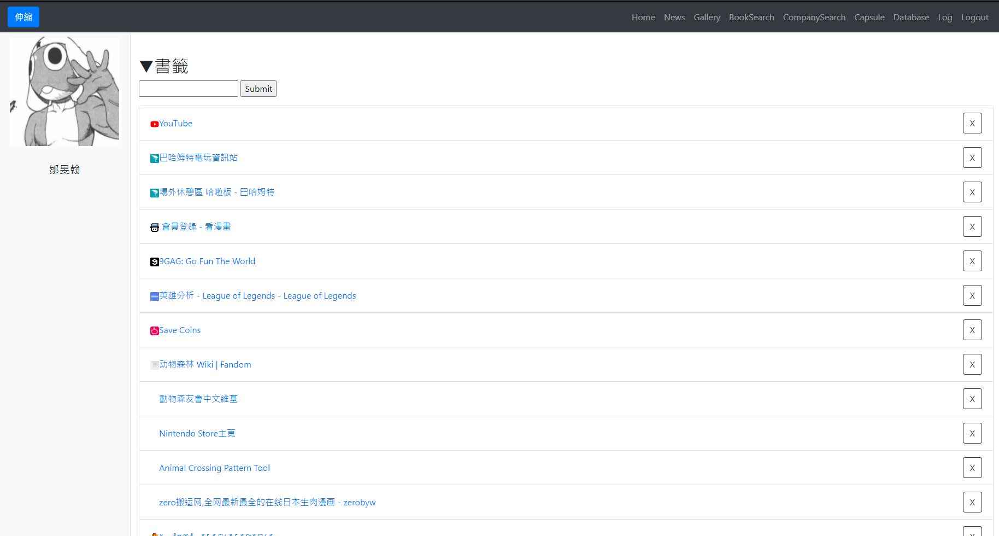
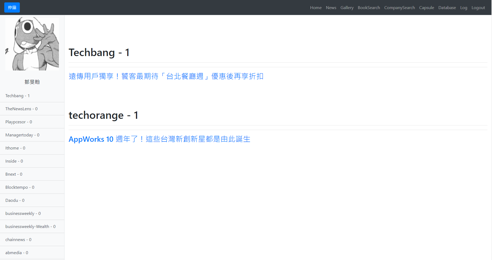
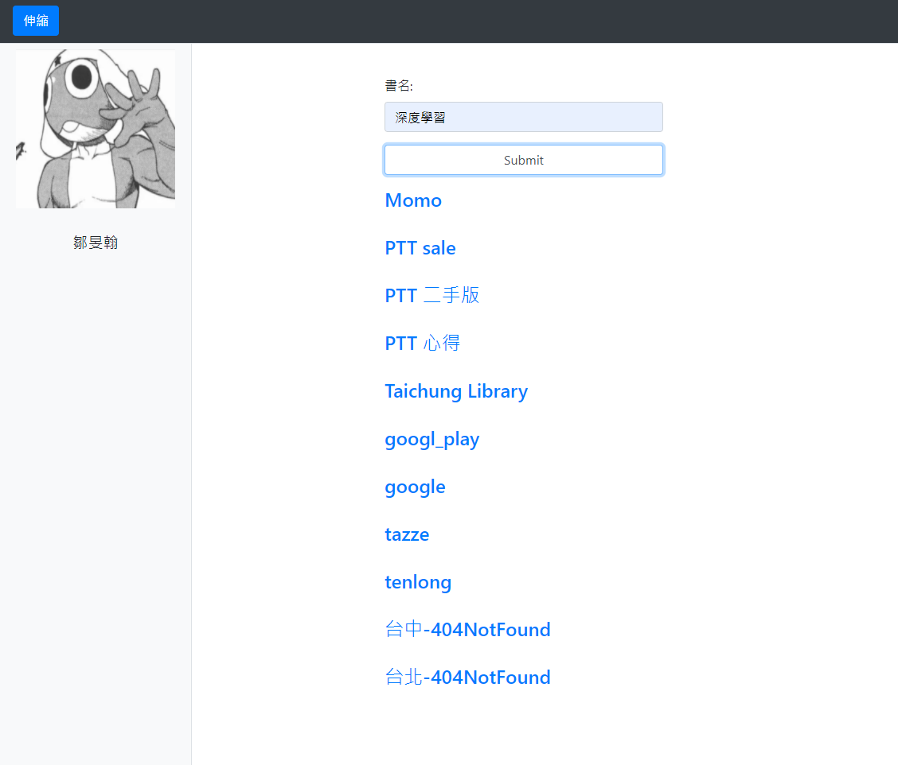
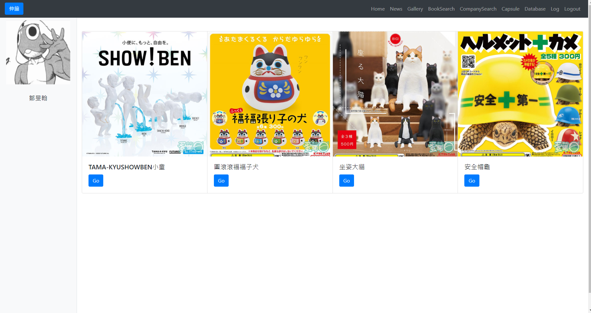
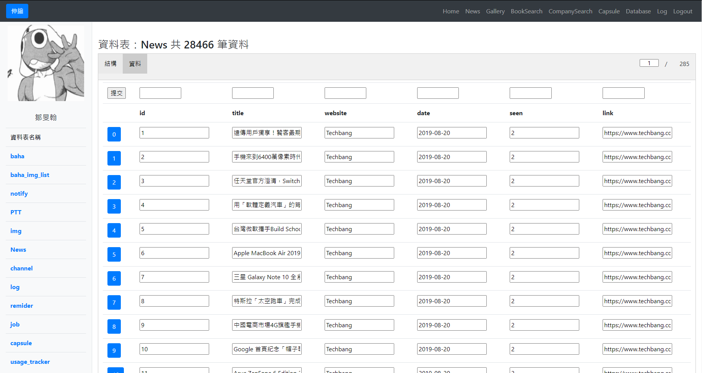
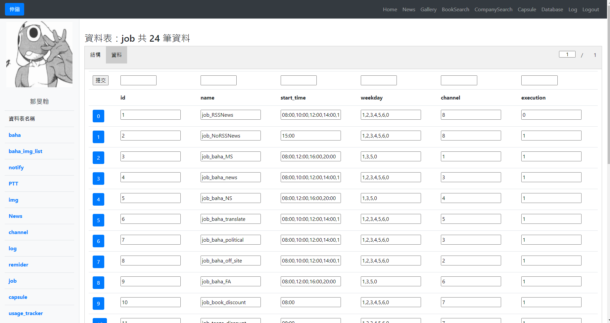

首頁是我的最愛，將一些玩樂的網站放在這而不是Chrome中，增加開啟網站的步驟減少直接點擊的次數（?）。

將資料庫中尚未閱讀的文章顯示出來，離開該頁面時將這些文章在資料庫中標記為已閱讀，若點擊該連結則標示為已點擊。

在欄位中輸入欲查詢的名稱，透過修改網址的方式將所有連結顯示出來，減少查書的步驟。

查看某網站的扭蛋最新商品，過濾掉已經看過的商品，同樣在離開該頁面時會在資料庫中修改這幾筆扭蛋資料的顯示狀態。

可以在這個頁面瀏覽目前資料庫中的資料，並且做CRUD處理。

在這個頁面可以修改爬蟲程式執行的時間點，以及次數。
